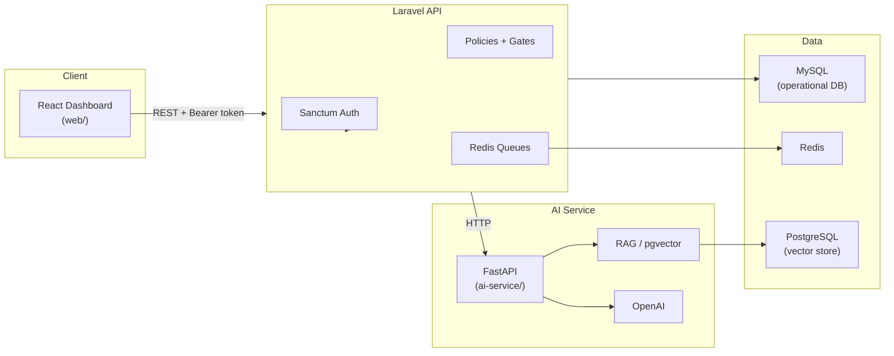

# DeployOps AI

A production-grade **Forward Deployed Engineering (FDE) / Applied AI** platform for managing customer deployments, secure integrations, AI copilots, knowledge bases, evaluations, and observability — all within multi-tenant workspaces with role-based access control.

> **Portfolio demo:** Sign in with `demo@deployops.ai` / `password` after running demo seed (see [Development Commands](#development-commands)).

## Use Case

DeployOps AI models the workflow of an FDE team embedding with enterprise customers:

1. **Onboard** a customer workspace with RBAC (owner, admin, engineer, viewer) and member invitations
2. **Track** customers and deployments through a pipeline (discovery → integration → build → validation → deployed)
3. **Connect** customer systems via a secure Integrations Hub (REST API + webhooks, write-only secrets)
4. **Operate** an AI copilot with strict tool calling, RAG over customer docs, and human-in-the-loop approvals for sensitive actions
5. **Measure** quality with evaluation datasets and monitor reliability with AI observability, traces, and incidents

The React dashboard provides full CRUD management for customers, deployments, integrations, knowledge documents, evaluations, and workspace members — with RBAC-aware UI, responsive dialogs, and consistent loading, error, and empty states.

## Architecture



**Data flow:** React + TypeScript → Laravel API → MySQL (operational data). AI workloads route to FastAPI → PostgreSQL + pgvector (embeddings). Redis backs Laravel queues (async knowledge processing) and cache.

## Features

| Area | Capabilities |
| --- | --- |
| **Dashboard & UX** | React 19 + TypeScript enterprise UI; responsive dialogs; loading, error, and empty states; live refresh for knowledge processing, approvals, and observability |
| **Auth & Tenancy** | Sanctum token auth, workspaces, member invitations, role management |
| **RBAC** | Owner / Admin / Engineer / Viewer roles with policy-enforced, role-aware UI across all management surfaces |
| **Customers & Deployments** | Create, edit, delete customers; create, edit, delete deployments; manage deployment pipeline stages |
| **Integrations Hub** | REST API + webhook integrations; encrypted write-only secrets; connection testing; create, edit, delete |
| **AI Copilot** | OpenAI Responses API with strict tool calling; stateless `store: false`; manual tool-call continuation within the request; deployment-scoped tools and authorization; safe OpenAI error classification; human-readable tool/action feedback |
| **Knowledge Base (RAG)** | PDF / TXT / MD uploads; async queue processing with pending → processing → ready / failed UI refresh; FastAPI chunking and embedding; PostgreSQL + pgvector; deployment/workspace-scoped retrieval; `search_knowledge` Copilot tool |
| **AI Evaluations** | Evaluation dataset CRUD; evaluation case CRUD (expected behavior, expected tools, expected sources); evaluation runs with pass rate, latency, and per-case results |
| **Human-in-the-Loop** | AI proposes sensitive deployment actions; proposals remain pending until explicitly reviewed; requester cannot approve their own proposal; another Owner/Admin must approve; authorized Owner/Admin may reject/cancel their own proposal; Engineer/Viewer cannot approve or reject; equivalent pending proposals are deduplicated; rejected actions do not modify deployment state; human-readable approval cards with requester identity; UI refreshes without manual page reload |
| **Observability** | AI request traces; latency; token usage; estimated cost; tool usage and failures; RAG usage; incidents; frontend refresh when new activity occurs |
| **Security** | Policy authorization on every mutating endpoint; workspace-scoped tenant isolation; integration secret redaction; rate limits |

## Stack

| Layer | Technology |
| --- | --- |
| API | Laravel 13 (PHP ^8.3) |
| Frontend | React 19, TypeScript, Vite |
| AI service | FastAPI (Python 3.13+) |
| Operational DB | MySQL |
| Vector store | PostgreSQL + pgvector (Docker) |
| Queues / cache | Redis |
| Auth | Laravel Sanctum |
| AI | OpenAI Responses API (server-side only) |
| Testing | Pest (PHP), pytest (Python), ESLint (React) |

## Local Setup

### Prerequisites

- PHP 8.3+, Composer
- Node.js 24+, npm
- Python 3.13+
- MySQL (e.g. via [Laravel Herd](https://herd.laravel.com))
- Docker (Redis + PostgreSQL/pgvector)

### 1. Laravel API

```bash
cp .env.example .env
php artisan key:generate
php artisan migrate
```

Configure MySQL in `.env`. Queues use Redis (`QUEUE_CONNECTION=redis`).

Demo data is **not** included in `db:seed` when `APP_ENV=production`. See [Development Commands](#development-commands).

### 2. Infrastructure (Redis + PostgreSQL)

```bash
docker compose up -d
```

| Service | Port | Purpose |
| --- | --- | --- |
| Redis | 6379 | Queues, cache |
| PostgreSQL (pgvector) | 5432 | AI service vector store (not Laravel DB) |

Both services include Docker health checks.

### 3. AI Service

```bash
cd ai-service
python -m venv .venv
# Windows: .venv\Scripts\activate
source .venv/bin/activate
pip install -r requirements.txt
uvicorn main:app --reload --port 8001
```

Set `AI_SERVICE_URL=http://127.0.0.1:8001` in the root `.env`. OpenAI credentials are configured server-side only.

### 4. React Dashboard

```bash
cd web
cp .env.example .env
npm install
npm run dev
```

Set `VITE_API_URL` to your Laravel API base URL (e.g. `http://deployops-ai.test`).

## Development Commands

Run these from the repo root unless noted.

### Redis + PostgreSQL (Docker)

```bash
docker compose up -d
```

Check health:

```bash
docker compose ps
```

### Demo seeding

Demo data seeds automatically in `local` / `demo` when you run `db:seed`. It is **never** seeded when `APP_ENV=production`.

```bash
# Local/demo: base seed + portfolio demo data
php artisan db:seed

# Demo data only
php artisan db:seed --class=DemoSeeder

# Non-local environments (not production): opt in explicitly
SEED_DEMO_DATA=true php artisan db:seed --class=DemoSeeder
```

### Queue worker

Required for async knowledge-document processing:

```bash
php artisan queue:work
```

### FastAPI (AI service)

```bash
cd ai-service
python -m venv .venv
# Windows:
.venv\Scripts\activate
# macOS/Linux:
source .venv/bin/activate
pip install -r requirements.txt
uvicorn main:app --reload --port 8001
```

Set `AI_SERVICE_URL=http://127.0.0.1:8001` in the root `.env`.

### React dashboard

```bash
cd web
cp .env.example .env
npm install
npm run dev
```

Production build:

```bash
cd web
npm run build
```

## Demo Accounts

After demo seeding (`php artisan db:seed` in `local` / `demo`, or `php artisan db:seed --class=DemoSeeder`):

| Email | Password | Role |
| --- | --- | --- |
| `demo@deployops.ai` | `password` | Owner |
| `admin@deployops.ai` | `password` | Admin |
| `engineer@deployops.ai` | `password` | Engineer |
| `viewer@deployops.ai` | `password` | Viewer |

Demo workspace **Acme Forward Deployed** includes customers (Globex Corp, Initech), deployments across pipeline stages, integrations, incidents, copilot traces, evaluation datasets, and a pending AI approval. Upload knowledge documents via the dashboard to populate the Knowledge Base.

## Health Endpoints

| Endpoint | Service | Success |
| --- | --- | --- |
| `GET /api/health` | Laravel API | `200` — `{"status":"ok","service":"api"}` |
| `GET /api/health/ai` | Laravel → FastAPI | `200` when AI service reachable; `503` on failure |
| `GET /health` | FastAPI | `200` — `{"status":"ok","service":"ai-service"}` |
| `GET /up` | Laravel | Framework health check |

The dashboard top bar shows API and AI service status. Copilot requests degrade gracefully when the AI service is unavailable (503 from `/api/health/ai`).

## Testing

```bash
# Laravel (Pest)
php artisan test

# React
cd web && npm run lint && npm run build

# FastAPI
cd ai-service && python -m pytest

# Docker Compose validation
docker compose config
```

## Security Model

- **Authentication:** Sanctum bearer tokens; auth endpoints rate-limited (5/min)
- **Authorization:** Laravel policies on every mutating endpoint; workspace-scoped tenant isolation via `scopeBindings()`; RBAC gates Owner/Admin/Engineer/Viewer capabilities in API and UI
- **Secrets:** Integration API keys and webhook secrets encrypted at rest; write-only on update (never returned in API responses — `has_api_key` booleans only)
- **Redaction:** Copilot question previews redacted; integration config and activity metadata sanitized before API output
- **Rate limits:** Auth (5/min), copilot (10/min), webhooks (60/min), authenticated API (120/min)
- **Input validation:** Form requests on all mutations; enum-validated AI action payloads

## Human-in-the-Loop Model

Sensitive deployment actions proposed by the AI Copilot follow a strict approval workflow:

1. **Proposal** — The copilot creates a pending `AiProposedAction` instead of mutating deployment state directly.
2. **Self-approval blocked** — The requester cannot approve their own proposal; another Owner or Admin must review it.
3. **Role enforcement** — Only Owner and Admin roles can approve or reject; Engineer and Viewer are read-only for approvals.
4. **Owner/Admin self-cancel** — An authorized Owner or Admin may reject or cancel a proposal they created.
5. **Idempotency** — Equivalent pending proposals are deduplicated so duplicate tool calls do not stack.
6. **Rejection is safe** — Rejected or cancelled actions never modify deployment state.
7. **Transparency** — Approval cards show human-readable action summaries and requester identity; the UI refreshes automatically after approve/reject without a page reload.

## Screenshots

> Add screenshots of the dashboard, copilot, observability, and approvals views here for portfolio presentation.

Suggested captures after seeding:
1. Dashboard with deployment pipeline and customer management
2. Integrations Hub with connection status and test results
3. Copilot with tool-call response and knowledge citations
4. Knowledge Base document list with processing status
5. Pending AI approvals with requester identity
6. Observability traces, token usage, and incidents
7. Team page with member invitations and role management
8. Evaluations with dataset cases and run results

## PR Roadmap

All planned PRs are complete. Subsequent frontend management, UX, and QA work (CRUD dialogs, invitation flows, live refresh, RBAC-aware UI polish) shipped as product polish on top of this sequence.

| PR | Focus | Status |
| --- | --- | --- |
| PR1 | Foundation — Laravel, React, FastAPI, health checks, CI | Done |
| PR2 | Authentication & Workspaces | Done |
| PR3 | RBAC & Member Access | Done |
| PR4 | Customers & Deployments | Done |
| PR5 | Secure Integrations Hub | Done |
| PR6 | AI Copilot & Tool Calling | Done |
| PR7 | RAG & Knowledge Base | Done |
| PR8 | AI Evaluations & HITL | Done |
| PR9 | Observability & Incidents | Done |
| PR10 | Production & Portfolio Polish | Done |

## CI

GitHub Actions (`.github/workflows/ci.yml`) runs on push/PR to `master`:

- Laravel tests (MySQL, PHP 8.4)
- React lint + build (Node 24)
- Python pytest (Python 3.13, PostgreSQL/pgvector)

## License

Proprietary — portfolio / demonstration project.
