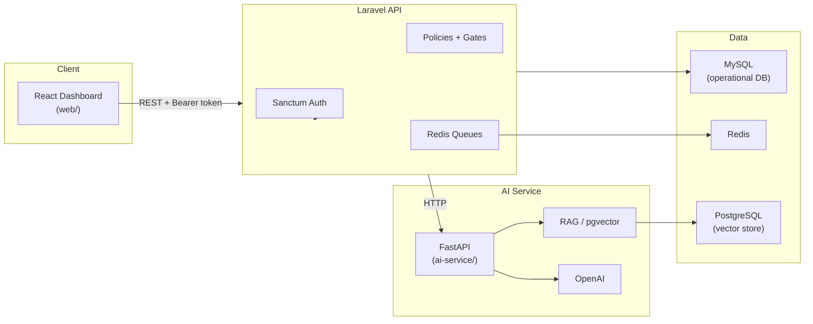

# DeployOps AI

A production-grade **Forward Deployed Engineering (FDE) / Applied AI** platform for managing customer deployments, secure integrations, AI copilots, knowledge bases, evaluations, and observability — all within multi-tenant workspaces with role-based access control.

> **Portfolio demo:** Sign in with `demo@deployops.ai` / `password` after running demo seed (see [Development Commands](#development-commands)).

## Use Case

DeployOps AI models the workflow of an FDE team embedding with enterprise customers:

1. **Onboard** a customer workspace with RBAC (owner, admin, engineer, viewer)
2. **Track** deployments through a pipeline (discovery → integration → build → validation → deployed)
3. **Connect** customer systems via a secure Integrations Hub (REST API + webhooks)
4. **Operate** an AI copilot with tool calling, RAG over customer docs, and human-in-the-loop approvals
5. **Measure** quality with evaluation datasets and monitor reliability with AI observability + incidents

## Architecture



## Features

| Area | Capabilities |
| --- | --- |
| **Auth & Tenancy** | Sanctum token auth, workspaces, RBAC (owner/admin/engineer/viewer) |
| **Customers & Deployments** | Multi-customer workspaces, deployment pipeline stages |
| **Integrations Hub** | REST API + webhook integrations, encrypted secrets, connection testing |
| **AI Copilot** | Tool-calling agent with deployment context, rate-limited |
| **Knowledge Base** | Document upload (PDF/MD/TXT), async processing, RAG search |
| **AI Evaluations** | Datasets, cases, automated run metrics |
| **Human Approval** | Pending AI actions with approve/reject workflow |
| **Observability** | AI health metrics, request traces, incident tracking |
| **Security** | Policy authorization, tenant isolation, secret redaction, rate limits |

## Stack

| Layer | Technology |
| --- | --- |
| API | Laravel (PHP 8.5+) |
| Frontend | React 19, TypeScript, Vite |
| AI service | FastAPI (Python 3.13+) |
| Operational DB | MySQL |
| Vector store | PostgreSQL + pgvector (Docker) |
| Queues / cache | Redis |
| Auth | Laravel Sanctum |
| Testing | Pest (PHP), pytest (Python), ESLint (React) |

## Local Setup

### Prerequisites

- PHP 8.5+, Composer
- Node.js 24+, npm
- Python 3.13+
- MySQL (e.g. via [Laravel Herd](https://herd.laravel.com))
- Docker (Redis + PostgreSQL/pgvector)

### 1. Laravel API

```bash
cp .env.example .env
php artisan key:generate
php artisan migrate
```

Configure MySQL in `.env`. Queues use Redis (`QUEUE_CONNECTION=redis`).

Demo data is **not** included in `db:seed` when `APP_ENV=production`. See [Development Commands](#development-commands).

### 2. Infrastructure (Redis + PostgreSQL)

```bash
docker compose up -d
```

| Service | Port | Purpose |
| --- | --- | --- |
| Redis | 6379 | Queues, cache |
| PostgreSQL (pgvector) | 5432 | AI service vector store (not Laravel DB) |

Both services include Docker health checks.

### 3. AI Service

```bash
cd ai-service
python -m venv .venv
# Windows: .venv\Scripts\activate
source .venv/bin/activate
pip install -r requirements.txt
uvicorn main:app --reload --port 8001
```

Set `AI_SERVICE_URL=http://127.0.0.1:8001` in the root `.env`.

### 4. React Dashboard

```bash
cd web
cp .env.example .env
npm install
npm run dev
```

Set `VITE_API_URL` to your Laravel API base URL (e.g. `http://deployops-ai.test`).

## Development Commands

Run these from the repo root unless noted.

### Redis + PostgreSQL (Docker)

```bash
docker compose up -d
```

Check health:

```bash
docker compose ps
```

### Demo seeding

Demo data seeds automatically in `local` / `demo` when you run `db:seed`. It is **never** seeded when `APP_ENV=production`.

```bash
# Local/demo: base seed + portfolio demo data
php artisan db:seed

# Demo data only
php artisan db:seed --class=DemoSeeder

# Non-local environments (not production): opt in explicitly
SEED_DEMO_DATA=true php artisan db:seed --class=DemoSeeder
```

### Queue worker

Required for async knowledge-document processing:

```bash
php artisan queue:work
```

### FastAPI (AI service)

```bash
cd ai-service
python -m venv .venv
# Windows:
.venv\Scripts\activate
# macOS/Linux:
source .venv/bin/activate
pip install -r requirements.txt
uvicorn main:app --reload --port 8001
```

Set `AI_SERVICE_URL=http://127.0.0.1:8001` in the root `.env`.

### React dashboard

```bash
cd web
cp .env.example .env
npm install
npm run dev
```

Production build:

```bash
cd web
npm run build
```

## Demo Accounts

After demo seeding (`php artisan db:seed` in `local` / `demo`, or `php artisan db:seed --class=DemoSeeder`):

| Email | Password | Role |
| --- | --- | --- |
| `demo@deployops.ai` | `password` | Owner |
| `admin@deployops.ai` | `password` | Admin |
| `engineer@deployops.ai` | `password` | Engineer |
| `viewer@deployops.ai` | `password` | Viewer |

Demo workspace **Acme Forward Deployed** includes customers (Globex Corp, Initech), deployments across pipeline stages, integrations, incidents, copilot traces, evaluation datasets, and a pending AI approval. Upload knowledge documents via the dashboard to populate the Knowledge Base.

## Health Endpoints

| Endpoint | Service | Success |
| --- | --- | --- |
| `GET /api/health` | Laravel API | `200` — `{"status":"ok","service":"api"}` |
| `GET /api/health/ai` | Laravel → FastAPI | `200` when AI service reachable; `503` on failure |
| `GET /health` | FastAPI | `200` — `{"status":"ok","service":"ai-service"}` |
| `GET /up` | Laravel | Framework health check |

The dashboard top bar shows API and AI service status. Copilot requests degrade gracefully when the AI service is unavailable (503 from `/api/health/ai`).

## Testing

```bash
# Laravel (Pest)
php artisan test

# React
cd web && npm run lint && npm run build

# FastAPI
cd ai-service && python -m pytest

# Docker Compose validation
docker compose config
```

## Security Model

- **Authentication:** Sanctum bearer tokens; auth endpoints rate-limited (5/min)
- **Authorization:** Laravel policies on every mutating endpoint; workspace-scoped tenant isolation via `scopeBindings()`
- **Secrets:** Integration API keys and webhook secrets encrypted at rest; never serialized to API responses (`has_api_key` booleans only)
- **Redaction:** Copilot question previews redacted; integration config and activity metadata sanitized before API output
- **Rate limits:** Auth (5/min), copilot (10/min), webhooks (60/min), authenticated API (120/min)
- **AI approvals:** Self-approval blocked; sensitive tool actions require owner/admin approval
- **Input validation:** Form requests on all mutations; enum-validated AI action payloads

## Screenshots

> Add screenshots of the dashboard, copilot, observability, and approvals views here for portfolio presentation.

Suggested captures after seeding:
1. Dashboard with deployment pipeline
2. Integrations Hub with connection status
3. Copilot with tool-call response
4. Knowledge Base document list
5. Pending AI approvals
6. Observability metrics and incidents

## PR Roadmap

| PR | Focus | Status |
| --- | --- | --- |
| PR1 | Foundation — Laravel, React, FastAPI, health checks, CI | Done |
| PR2 | Auth + Workspaces + RBAC | Done |
| PR3 | Customers + Deployments | Done |
| PR4 | Secure Integrations Hub | Done |
| PR5 | AI Copilot + Tool Calling | Done |
| PR6 | RAG + Knowledge Base | Done |
| PR7 | AI Evals + Human Approval | Done |
| PR8 | AI Observability + Incidents | Done |
| PR9 | *(reserved)* | — |
| PR10 | Production & Portfolio Polish | Done |

## CI

GitHub Actions (`.github/workflows/ci.yml`) runs on push/PR to `master`:

- Laravel tests (MySQL)
- React lint + build
- Python pytest

## License

Proprietary — portfolio / demonstration project.
