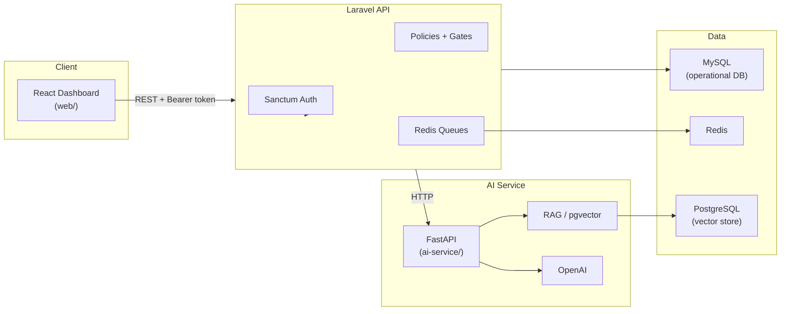

# DeployOps AI

DeployOps AI is a production-oriented **Applied AI / Forward Deployed Engineering (FDE)** platform that explores how AI can help software teams understand complex systems, work with project knowledge, investigate problems, and propose controlled actions while keeping people in the decision loop.

The project brings together full-stack engineering, RAG, tool calling, evaluations, observability, secure integrations, and human-in-the-loop workflows in an end-to-end system designed to explore AI beyond the chatbot interface.

> **Active Development** — Foundation milestones (PR1–PR10) are complete, but DeployOps AI is still evolving through incremental PRs focused on project intelligence, grounded context, reliability, and portfolio polish. See [PR Roadmap](#pr-roadmap).

> **Portfolio demo:** Sign in with `demo@deployops.ai` / `password` after running demo seed (see [Development Commands](#development-commands)).

## Why I Built This

DeployOps AI started with a question I kept coming back to while working on real software projects:

**What if AI could help engineers understand a system before helping them change it?**

In my experience, writing the code is often not the hardest part. The difficult part is understanding the context around a change — why something works the way it does, which business rules matter, what other parts of the system could be affected, and what previous decisions led to the current implementation.

As AI coding tools became more capable, I became curious about what could come next. I was not interested in building another chatbot or adding AI simply to say a product had AI. I wanted to explore whether AI could become useful in the part of engineering that requires context, judgment, and responsibility.

That curiosity became **DeployOps AI**.

I chose to build the problem end to end instead of treating it as an isolated AI experiment. As the project evolved, each stage pushed me to think beyond the model itself: how project knowledge is gathered, how answers are grounded, how actions are controlled, how failures become visible, how quality is measured, and when a human should make the final decision.

The biggest lesson has been that making AI useful in real software systems is not only about choosing a better model or writing better prompts. The surrounding engineering matters just as much: **context, reliability, traceability, security, evaluation, observability, and human judgment**.

DeployOps AI is still evolving, and that is part of the purpose of the project. It represents not only what I have built, but also how my thinking about AI-assisted engineering continues to evolve as I test ideas, find limitations, and improve the system.

The question I want to keep exploring is simple:

**How can we make AI genuinely useful to software teams without giving up the engineering discipline that makes production systems reliable?**

## What This Project Demonstrates

- **End-to-end ownership** — Taking an idea from problem framing and product workflows through backend, frontend, AI services, infrastructure, testing, and CI.
- **Applied AI beyond the chatbot** — Combining scoped RAG, strict tool calling, evaluations, and project context to support useful engineering workflows.
- **Human-centered AI design** — Keeping sensitive actions behind explicit human approval instead of treating autonomy as the goal by default.
- **Production engineering** — Building a multi-service system with Laravel, FastAPI, React, async queues, health checks, graceful degradation, and cross-stack CI.
- **Security and reliability mindset** — Designing around tenant isolation, authorization, protected secrets, traceability, observability, and measurable AI behavior.
- **Continuous learning** — Using the project to test ideas, identify limitations, and improve how AI, software architecture, and human decision-making work together.

## Use Case

DeployOps AI models the workflow of an FDE team embedding with enterprise customers:

1. **Onboard** a customer workspace with RBAC (owner, admin, engineer, viewer) and member invitations
2. **Track** customers and deployments through a pipeline (discovery → integration → build → validation → deployed)
3. **Connect** customer systems via a secure Integrations Hub (REST API + webhooks, write-only secrets)
4. **Operate** an AI copilot with strict tool calling, RAG over customer docs, and human-in-the-loop approvals for sensitive actions
5. **Measure** quality with evaluation datasets and monitor reliability with AI observability, traces, and incidents

The React dashboard provides full CRUD management for customers, deployments, integrations, knowledge documents, evaluations, and workspace members — with RBAC-aware UI, responsive dialogs, and consistent loading, error, and empty states.

## Architecture


```mermaid
flowchart LR
    subgraph Client
        Web["React Dashboard<br/>(web/)"]
    end

    subgraph API["Laravel API"]
        Auth["Sanctum Auth"]
        RBAC["Policies + Gates"]
        Queue["Redis Queues"]
    end

    subgraph AI["AI Service"]
        FastAPI["FastAPI<br/>(ai-service/)"]
        RAG["RAG / pgvector"]
        OpenAI["OpenAI"]
    end

    subgraph Data
        MySQL["MySQL<br/>(operational DB)"]
        Redis["Redis"]
        PG["PostgreSQL<br/>(vector store)"]
    end

    Web -->|REST + Bearer token| API
    API --> Auth
    API --> RBAC
    API --> Queue
    API -->|HTTP| FastAPI
    FastAPI --> RAG
    FastAPI --> OpenAI
    RAG --> PG
    API --> MySQL
    Queue --> Redis
```

**Data flow:** React + TypeScript → Laravel API → MySQL (operational data). AI workloads route to FastAPI → PostgreSQL + pgvector (embeddings). Redis backs Laravel queues (async knowledge processing) and cache.

## Features

| Area | Capabilities |
| --- | --- |
| **Dashboard & UX** | React 19 + TypeScript enterprise UI; responsive dialogs; loading, error, and empty states; live refresh for knowledge processing, approvals, and observability |
| **Auth & Tenancy** | Sanctum token auth, workspaces, member invitations, role management |
| **RBAC** | Owner / Admin / Engineer / Viewer roles with policy-enforced, role-aware UI across all management surfaces |
| **Customers & Deployments** | Create, edit, delete customers; create, edit, delete deployments; manage deployment pipeline stages |
| **Integrations Hub** | REST API + webhook integrations; encrypted write-only secrets; connection testing; create, edit, delete |
| **AI Copilot** | OpenAI Responses API with strict tool calling; stateless `store: false`; manual tool-call continuation within the request; deployment-scoped tools and authorization; safe OpenAI error classification; human-readable tool/action feedback |
| **Knowledge Base (RAG)** | PDF / TXT / MD uploads; async queue processing with pending → processing → ready / failed UI refresh; FastAPI chunking and embedding; PostgreSQL + pgvector; deployment/workspace-scoped retrieval; `search_knowledge` Copilot tool |
| **AI Evaluations** | Evaluation dataset CRUD; evaluation case CRUD (expected behavior, expected tools, expected sources); evaluation runs with pass rate, latency, and per-case results |
| **Human-in-the-Loop** | AI proposes sensitive deployment actions; proposals remain pending until explicitly reviewed; requester cannot approve their own proposal; another Owner/Admin must approve; authorized Owner/Admin may reject/cancel their own proposal; Engineer/Viewer cannot approve or reject; equivalent pending proposals are deduplicated; rejected actions do not modify deployment state; human-readable approval cards with requester identity; UI refreshes without manual page reload |
| **Observability** | AI request traces; latency; token usage; estimated cost; tool usage and failures; RAG usage; incidents; frontend refresh when new activity occurs |
| **Security** | Policy authorization on every mutating endpoint; workspace-scoped tenant isolation; integration secret redaction; rate limits |

## Stack

| Layer | Technology |
| --- | --- |
| API | Laravel 13 (PHP ^8.3) |
| Frontend | React 19, TypeScript, Vite |
| AI service | FastAPI (Python 3.13+) |
| Operational DB | MySQL |
| Vector store | PostgreSQL + pgvector (Docker) |
| Queues / cache | Redis |
| Auth | Laravel Sanctum |
| AI | OpenAI Responses API (server-side only) |
| Testing | Pest (PHP), pytest (Python), ESLint (React) |

## Local Setup

### Prerequisites

- PHP 8.3+, Composer
- Node.js 24+, npm
- Python 3.13+
- MySQL (e.g. via [Laravel Herd](https://herd.laravel.com))
- Docker (Redis + PostgreSQL/pgvector)

### 1. Laravel API

```bash
cp .env.example .env
php artisan key:generate
php artisan migrate
```

Configure MySQL in `.env`. Queues use Redis (`QUEUE_CONNECTION=redis`).

Demo data is **not** included in `db:seed` when `APP_ENV=production`. See [Development Commands](#development-commands).

### 2. Infrastructure (Redis + PostgreSQL)

```bash
docker compose up -d
```

| Service | Port | Purpose |
| --- | --- | --- |
| Redis | 6379 | Queues, cache |
| PostgreSQL (pgvector) | 5432 | AI service vector store (not Laravel DB) |

Both services include Docker health checks.

### 3. AI Service

```bash
cd ai-service
python -m venv .venv
# Windows: .venv\Scripts\activate
source .venv/bin/activate
pip install -r requirements.txt
uvicorn main:app --reload --port 8001
```

Set `AI_SERVICE_URL=http://127.0.0.1:8001` in the root `.env`. OpenAI credentials are configured server-side only.

### 4. React Dashboard

```bash
cd web
cp .env.example .env
npm install
npm run dev
```

Set `VITE_API_URL` to your Laravel API base URL (e.g. `http://deployops-ai.test`).

## Development Commands

Run these from the repo root unless noted.

### Redis + PostgreSQL (Docker)

```bash
docker compose up -d
```

Check health:

```bash
docker compose ps
```

### Demo seeding

Demo data seeds automatically in `local` / `demo` when you run `db:seed`. It is **never** seeded when `APP_ENV=production`.

```bash
# Local/demo: base seed + portfolio demo data
php artisan db:seed

# Demo data only
php artisan db:seed --class=DemoSeeder

# Non-local environments (not production): opt in explicitly
SEED_DEMO_DATA=true php artisan db:seed --class=DemoSeeder
```

### Queue worker

Required for async knowledge-document processing:

```bash
php artisan queue:work
```

### FastAPI (AI service)

```bash
cd ai-service
python -m venv .venv
# Windows:
.venv\Scripts\activate
# macOS/Linux:
source .venv/bin/activate
pip install -r requirements.txt
uvicorn main:app --reload --port 8001
```

Set `AI_SERVICE_URL=http://127.0.0.1:8001` in the root `.env`.

### React dashboard

```bash
cd web
cp .env.example .env
npm install
npm run dev
```

Production build:

```bash
cd web
npm run build
```

## Demo Accounts

After demo seeding (`php artisan db:seed` in `local` / `demo`, or `php artisan db:seed --class=DemoSeeder`):

| Email | Password | Role |
| --- | --- | --- |
| `demo@deployops.ai` | `password` | Owner |
| `admin@deployops.ai` | `password` | Admin |
| `engineer@deployops.ai` | `password` | Engineer |
| `viewer@deployops.ai` | `password` | Viewer |

Demo workspace **Acme Forward Deployed** includes customers (Globex Corp, Initech), deployments across pipeline stages, integrations, incidents, copilot traces, evaluation datasets, and a pending AI approval. Upload knowledge documents via the dashboard to populate the Knowledge Base.

## Health Endpoints

| Endpoint | Service | Success |
| --- | --- | --- |
| `GET /api/health` | Laravel API | `200` — `{"status":"ok","service":"api"}` |
| `GET /api/health/ai` | Laravel → FastAPI | `200` when AI service reachable; `503` on failure |
| `GET /health` | FastAPI | `200` — `{"status":"ok","service":"ai-service"}` |
| `GET /up` | Laravel | Framework health check |

The dashboard top bar shows API and AI service status. Copilot requests degrade gracefully when the AI service is unavailable (503 from `/api/health/ai`).

## Testing

```bash
# Laravel (Pest)
php artisan test

# React
cd web && npm run lint && npm run build

# FastAPI
cd ai-service && python -m pytest

# Docker Compose validation
docker compose config
```

## Security Model

- **Authentication:** Sanctum bearer tokens; auth endpoints rate-limited (5/min)
- **Authorization:** Laravel policies on every mutating endpoint; workspace-scoped tenant isolation via `scopeBindings()`; RBAC gates Owner/Admin/Engineer/Viewer capabilities in API and UI
- **Secrets:** Integration API keys and webhook secrets encrypted at rest; write-only on update (never returned in API responses — `has_api_key` booleans only)
- **Redaction:** Copilot question previews redacted; integration config and activity metadata sanitized before API output
- **Rate limits:** Auth (5/min), copilot (10/min), webhooks (60/min), authenticated API (120/min)
- **Input validation:** Form requests on all mutations; enum-validated AI action payloads

## Human-in-the-Loop Model

Sensitive deployment actions proposed by the AI Copilot follow a strict approval workflow:

1. **Proposal** — The copilot creates a pending `AiProposedAction` instead of mutating deployment state directly.
2. **Self-approval blocked** — The requester cannot approve their own proposal; another Owner or Admin must review it.
3. **Role enforcement** — Only Owner and Admin roles can approve or reject; Engineer and Viewer are read-only for approvals.
4. **Owner/Admin self-cancel** — An authorized Owner or Admin may reject or cancel a proposal they created.
5. **Idempotency** — Equivalent pending proposals are deduplicated so duplicate tool calls do not stack.
6. **Rejection is safe** — Rejected or cancelled actions never modify deployment state.
7. **Transparency** — Approval cards show human-readable action summaries and requester identity; the UI refreshes automatically after approve/reject without a page reload.

## Screenshots

> Add screenshots of the dashboard, copilot, observability, and approvals views here for portfolio presentation.

Suggested captures after seeding:
1. Dashboard with deployment pipeline and customer management
2. Integrations Hub with connection status and test results
3. Copilot with tool-call response and knowledge citations
4. Knowledge Base document list with processing status
5. Pending AI approvals with requester identity
6. Observability traces, token usage, and incidents
7. Team page with member invitations and role management
8. Evaluations with dataset cases and run results

## PR Roadmap

### Foundation milestones (PR1–PR10) — Complete

These ten PRs delivered the core platform: auth and tenancy through copilot, RAG, evaluations, human-in-the-loop controls, observability, and initial portfolio polish.

| PR | Focus | Status |
| --- | --- | --- |
| PR1 | Foundation — Laravel, React, FastAPI, health checks, CI | Done |
| PR2 | Authentication & Workspaces | Done |
| PR3 | RBAC & Member Access | Done |
| PR4 | Customers & Deployments | Done |
| PR5 | Secure Integrations Hub | Done |
| PR6 | AI Copilot & Tool Calling | Done |
| PR7 | RAG & Knowledge Base | Done |
| PR8 | AI Evaluations & HITL | Done |
| PR9 | Observability & Incidents | Done |
| PR10 | Production & Portfolio Polish | Done |

### Active development (post-foundation)

Work continues beyond the foundation sequence. Incremental PRs ship additional capabilities; some areas are still in progress.

| Area | Status |
| --- | --- |
| Frontend management workflows & HITL UX | Shipped |
| Governed project documentation | Shipped |
| Project intelligence (structured facts + human verification) | Shipped |
| Hybrid grounded context builder | Shipped |
| Portfolio presentation (screenshots, extended docs) | In progress |
| Additional incremental PRs | Planned |

The [Features](#features) section documents the foundation platform. Post-foundation work continues incrementally and is reflected in the roadmap and commit history.

## CI

GitHub Actions (`.github/workflows/ci.yml`) runs on push/PR to `master`:

- Laravel tests (MySQL, PHP 8.4)
- React lint + build (Node 24)
- Python pytest (Python 3.13, PostgreSQL/pgvector)

## License

Proprietary — portfolio / demonstration project.
